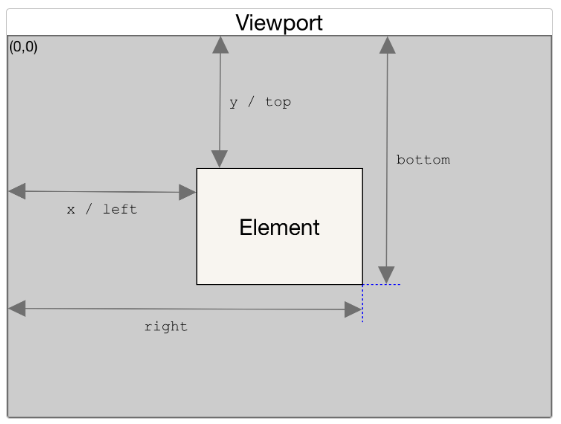
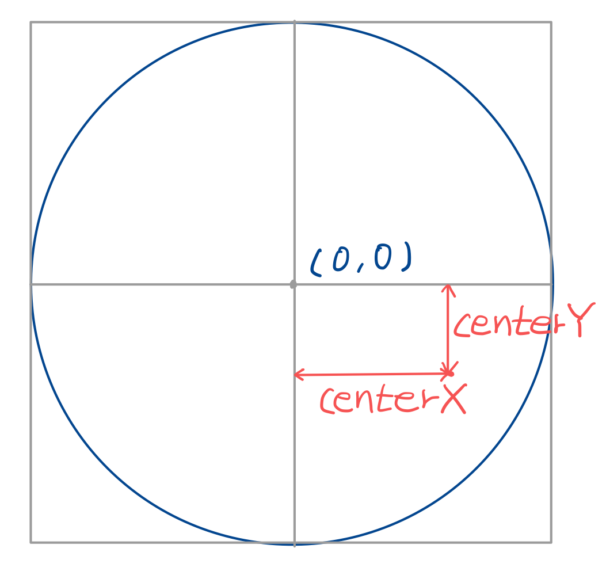

# 3d card

## getBoundingClientRect()
element의 left/x, top/y, bottom, right, width, heigh 값을 반환하는 함수

## mousmove(e)
카드 위 마우스 좌표 실시간으로 적용하기 위한 함수

## rotate3d
카드에 마우스가 다가갔을 때 기울어지는 효과

`
transform: rotate3d(x, y, z, a)
`

- x: 0과 1 사이 값, 회전축을 나타내는 벡터 x 좌표
- y: 0과 1 사이 값, 회전축을 나타내는 벡터 y 좌표
- z: 0과 1 사이 값, 회전축을 나타내는 벡터 z 좌표
- a: 회전하는 각도, 양의 각도는 시계방향 회전, 음의 각도는 시계 반대 방향의 회전을 나타낸다

x, y 값으로 0에서 1 사이 값이 올 수 있도록 centerX값과 centerY값을 100으로 나눠주었다

회전 각도 a 값은 피타고라스의 정리를 사용하여 카드의 끝으로 갈수록 더 기울어지게 했다. 그리고 값을 8로 나누어 적당한 정도로 회전하도록 하였다.

## 밝기 조절
`
background-image: radial-gradient(circle at 중심이 될 위치, 중심 색, 중간 색, 끝 색)
`

 중심이 될 위치는 `${left}px ${top}px`
