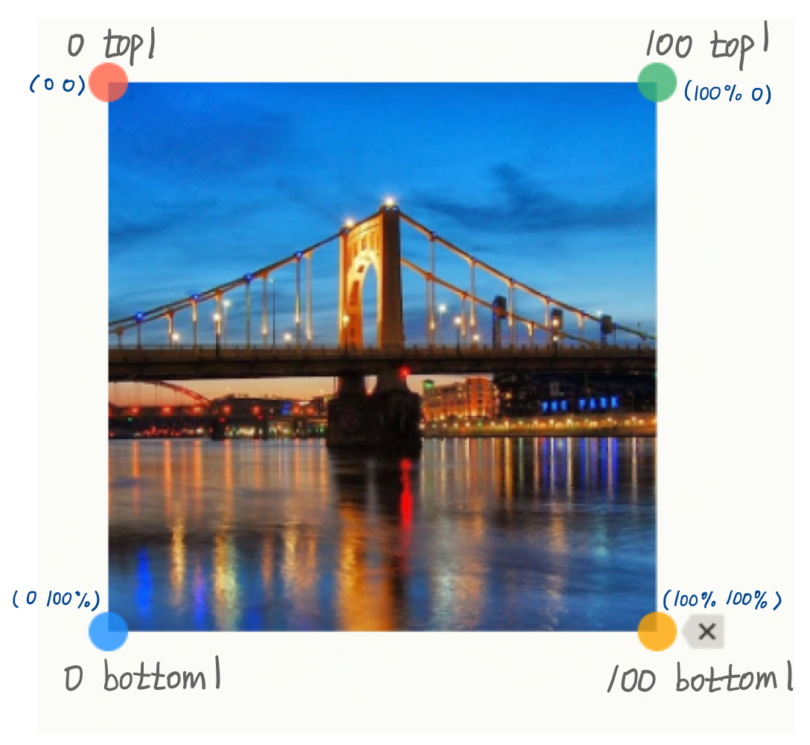

# site intro effect

## glitch effect

효과를 원하는 제목 위에 가상요소 ::before와 ::after을 만든 후
pointion: absolute;를 이용해 제목 위에 띄워준다

그 다음 text-shadow를 가상요소에 각각 만들어준다

그리고 단면 모습으로 돌아와서 ::after요소에는 왼쪽으로 5px,
::before 요소에는 오른쪽으로 5px 준다

### clip path 속성 (glich 효과에 핵심)
SVG 요소를 조각(Clipping)한다
https://developer.mozilla.org/en-US/docs/Web/CSS/clip-path
https://bennettfeely.com/clippy/

```css
/* Keyword values */
clip-path: none;

/* <clip-source> values */
clip-path: url(resources.svg#c1);

/* <geometry-box> values */
clip-path: margin-box;
clip-path: border-box;
clip-path: padding-box;
clip-path: content-box;
clip-path: fill-box;
clip-path: stroke-box;
clip-path: view-box;

/* <basic-shape> values */
clip-path: inset(100px 50px);
clip-path: circle(50px at 0 100px);
clip-path: ellipse(50px 60px at 0 10% 20%);
clip-path: polygon(50% 0%, 100% 50%, 50% 100%, 0% 50%);
clip-path: path(
  "M0.5,1 C0.5,1,0,0.7,0,0.3 A0.25,0.25,1,1,1,0.5,0.3 A0.25,0.25,1,1,1,1,0.3 C1,0.7,0.5,1,0.5,1 Z"
);

/* Box and shape values combined */
clip-path: padding-box circle(50px at 0 100px);

/* Global values */
clip-path: inherit;
clip-path: initial;
clip-path: revert;
clip-path: revert-layer;
clip-path: unset;
```
polygon(): SVG 채우기 규칙과 정점 집합을 사용하여 다각형을 정의한다

노이즈가 가로로 보이게 하기 위해서는 polygon의 1, 2 번째 요소와 3, 4번째 요소의 두 번쨰 값(세로로 움직이는 값)이 같아야 하고 가로로 움직이는 값은 고정해야한다

```css
clip-path: polygon(0 top1, 100 top1, 100 bottom1, 0 bottom1);
```


더 쉽게는 아래처럼 할 수 있음
```css
clip-path: inset(top1 0 bottom1 0)
```
