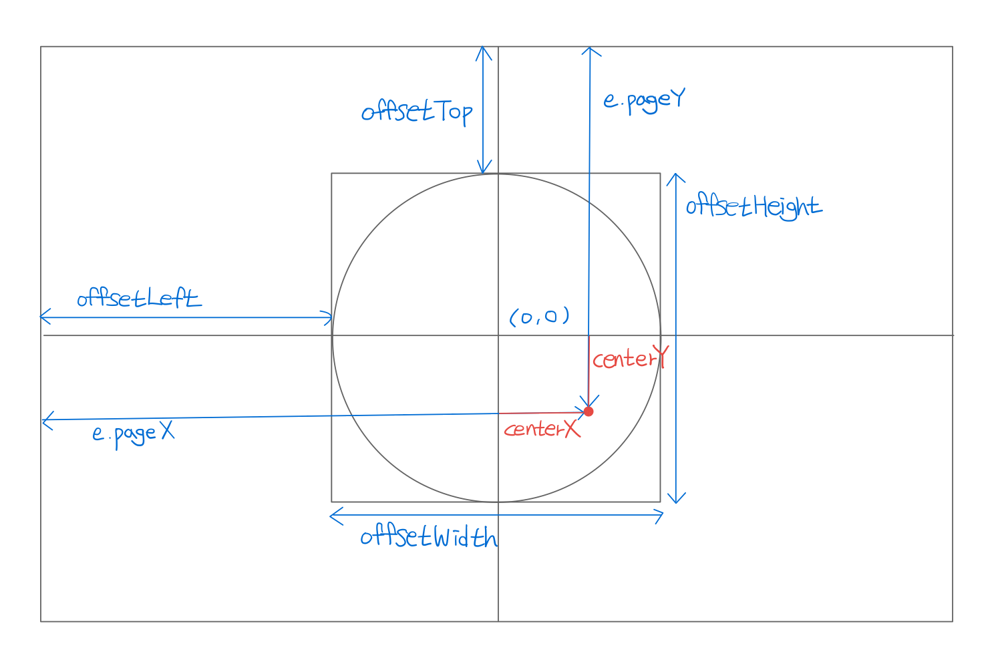

# Magnetic Button 

버튼의 중심을 (0,0)으로 두고 이를 기준으로 마우스 커서 위치의 좌표는 (centerX, centerY)로 둔다

### (centerX, centerY), d
centerX = e.pageX - offsetLeft - offsetWidth/2

centerY = e.pageY - offsetTop - offsetHeight/2

d = `Math.sqrt(centerX**2 + centerY**2)`



### translate3d
translate3d를 사용하여 element가 마우스를 따라올 수 있도록 한다

### rotate3d
rotate3d를 사용하여 버튼 위 글자가 마우스를 따라올 때 따라온 정도에 따라 기울어지게 하여 글씨가 입체적으로 보이게 한다

## gsap 라이브러리를 이용한 용수철 효과

https://greensock.com/gsap/

1. head에 script에 사용할 gsap 라이브러리를 가져온다

``` html
<head>
    ...
    <script  src="https://cdnjs.cloudflare.com/ajax/libs/gsap/3.10.4/gsap.min.js" integrity="sha512-VEBjfxWUOyzl0bAwh4gdLEaQyDYPvLrZql3pw1ifgb6fhEvZl9iDDehwHZ+dsMzA0Jfww8Xt7COSZuJ/slxc4Q==" crossorigin="anonymous" referrerpolicy="no-referrer"></script>
</head>
```

2. gsap을 사용한 표현으로 고치고 gsap의 ease에 Elastic.easeOut을 넣어주면 튕기는 효과가 발생한다
(gsap 사이트에서 원하는 효가 복사 붙여넣기 하면 됨)

``` javascript

element.style.transform = `
    translate3d(${centerX/1.5}px, ${centerY/1.5}px, 0)
`
gsap.to(element, 0.5, {
    x: centerX / 1.5,
    y: centerY / 1.5,
    ease: Elastic.easeOut
})
```