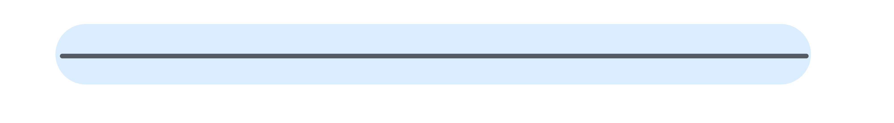

# scroll을 따라 path가 그려지는 animation

## stroke-dasharray

path 엘리면트를 작대기로 바꿔준다
홀수번때 인자는 dash 길이
짝수번째 인자는 공백 길이다.

만약 값이 숫자 하나이면( ex. stroke-dasharray = 1000;)

path.getTotalLength() 는 구불구불한 path의 총 길이를 반환한다

## stroke-dashoffset: n 

n픽셀 뒤부터 path를 그리기 시작한다(어디서부터 그릴지 정함)

## path가 그려지는 비율 계산

ratio = (b+c-a)/d (%)

stroke-dashoffset: path 총 길이 - (path 총 길이 * ratio)

